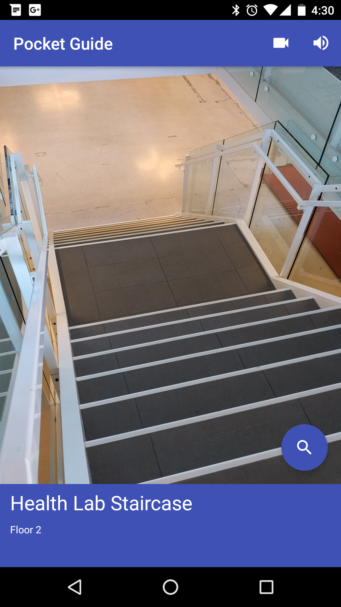
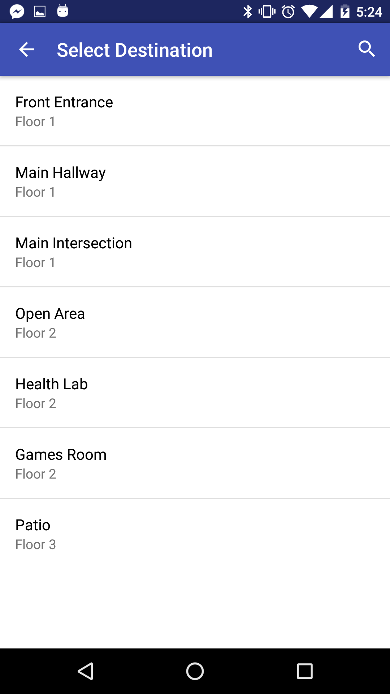
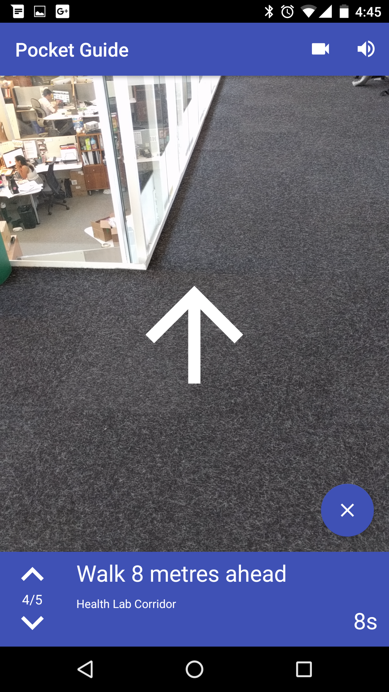
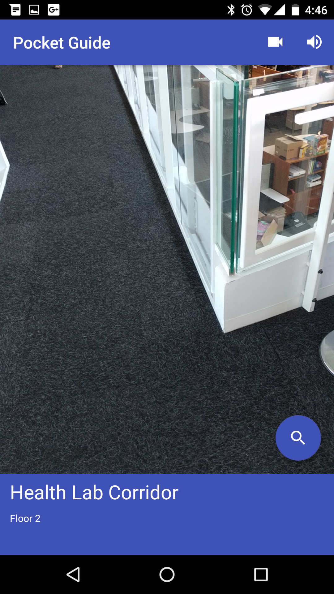
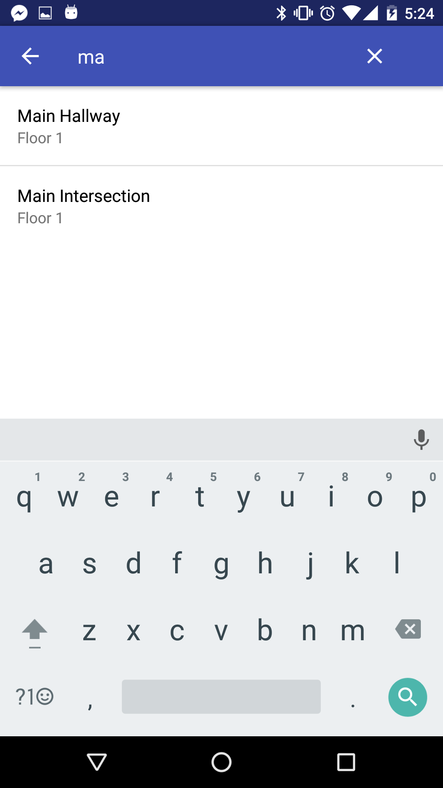
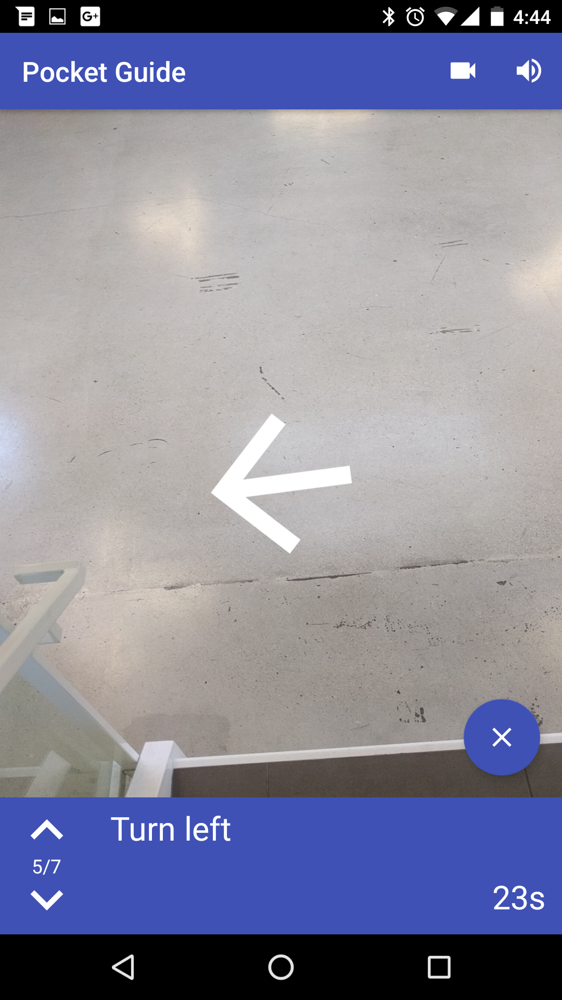

# Pocket Guide - Android

An Android application that uses Estimote beacons to help the user navigate an indoor environment.

Developed at [Cossette](http://www.cossette.com) in July-August 2016 and demonstrated to representatives from [SickKids](http://www.sickkids.ca).

## Interface

Discovery                       | Search                       | Navigation
------------------------------- | ---------------------------- | --------------------------------
 |  |  
 |  | 

### Discovery Mode

Shows the user their current floor and location.

### Search

Allows the user to search for a place to navigate to.

### Navigation Mode

Provides turn-by-turn instructions to guide the user to their destination; uses text and audio instructions, on-screen arrows, and device vibrations.

## Beacons and Tracking

See the `beacons` package; the `ApplicationBeaconManager` class manages and tracks beacons over time.

Each beacon broadcasts Bluetooth signals at 950ms intervals according to the iBeacon standard (https://developer.apple.com/ibeacon/, http://developer.estimote.com/ibeacon/).
The application receives these signals and decides what to do based on the IDs and signal strength received.

[Estimote](http://estimote.com)

[Estimote Developer](http://developer.estimote.com)

[Estimote Android SDK](https://github.com/Estimote/Android-SDK)

[Estimote Android SDK Documentation](http://estimote.github.io/Android-SDK/JavaDocs/)

[Beacon Physics](http://blog.estimote.com/post/106913675010/how-do-beacons-work-the-physics-of-beacon-tech)

[Beacon Signal Properties](https://community.estimote.com/hc/en-us/articles/201636913-What-are-Broadcasting-Power-RSSI-and-other-characteristics-of-beacon-s-signal-)

### Beacon Distance/Proximity

Given the signal strength received from a beacon, the Estimote SDK provides an API that calculates the estimated distance to that beacon. The application uses a weighted average to better approximate the current distance to that beacon, with the most recent measurement having the greatest weight.

### User Location/Proximity

In discovery mode, the nearest estimated beacon is said to be the user's current location.

In navigation mode, the instructions change when the device is estimated to be within 3m of a beacon where the path changes.

### Trilateration

Trilateration can be attempted, but is not accurate or reliable due to the beacons' weak signal strength, fluctuating measurements, and interference from floors, objects, and people.

[Wiki](https://en.wikipedia.org/wiki/Trilateration)

[Algorithm](https://github.com/lemmingapex/Trilateration)

[Apache Commons Math Library](http://commons.apache.org/proper/commons-math/)

## Mapping Data

See the `map` package; the `Map` class defines and manages the mapping data, which is based on a 3D grid system (x, y, and z axes).

### Floors

- Define floors of the building
- z-position on the grid

### Beacons

- Correspond to Estimote beacons
- Belong to a floor
- x-y position on the grid
- ID numbers (UUID, major, minor)

Anchor Beacons - Placed at key intersection points between areas (e.g. doors, entrances/exits, stairs, elevators).

Support Beacons - Placed at other points.

### Zones

- Define areas of the building
- Have a type (e.g. room, hallway, stairs, elevator)
- Can span multiple floors
- Must be defined so that the user can move between any two of its beacons in a straight line (necessary for the pathfinding algorithm)
- May be a destination the user can navigate to

### Units

All units are in metres and seconds.

### Pathfinding

See the `pathfinding` package; the `Pathfinder` and `SPFA` classes perform the shortest-path algorithm, while the `NavigationStep`, `Path`, and `Step` classes manage the navigation information.

The application uses [SPFA](https://en.wikipedia.org/wiki/Shortest_Path_Faster_Algorithm) and the mapping data to calculate the shortest path to the destination by time.

The map's graph is constructed using relationships between beacons and zones. Two beacons are connected in the graph if they share a common zone (can be moved between in a straight line). The connection weight is the travel time between the two beacons, calculated using the straight-line distance and average movement speed.

## Debugging

While not visible in the final application, debugging tools were used in development of this application.

See `@+id/debug_view` in `content_main.xml` and `onCreate()` in `MainActivity.java` to enable the debugging view that displays information on the main screen.

See `@+id/action_debug` in `menu_main.xml` to enable the information button on the main screen, which switches to a dedicated debugging screen when tapped.

## Team

Bruno Almeida: https://github.com/b-almeida

Gabriel Yeung: https://github.com/gabrielcyeung

Jacob Kelly: https://github.com/jacobjinkelly
